# ARC Phase Timelines

Generated from active specs. Use these as timing-reference diagrams for narration and mix decisions.

## ARC-1TB - Adaptive Respiratory Cycle — Tribal Breath

Duration: **60m** (3600s)

```mermaid
gantt
title ARC-1TB Phase Timeline
dateFormat X
axisFormat %M:%S
section Session
Ground : 0, 600
Activation Ramp : 600, 600
Boundary Softening : 1200, 900
Wave Cycling : 2100, 900
Reintegration : 3000, 600
```

| Phase | Start | End | Intent |
|---|---:|---:|---|
| Ground | 00:00 | 10:00 | Establish baseline coherence |
| Activation Ramp | 10:00 | 20:00 | Gradual sympathetic activation |
| Boundary Softening | 20:00 | 35:00 | Controlled intensity plateau |
| Wave Cycling | 35:00 | 50:00 | Oscillating depth with contrast |
| Reintegration | 50:00 | 60:00 | Smooth parasympathetic return |

## ARC-2 - Gentle Activation

Duration: **45m** (2700s)

```mermaid
gantt
title ARC-2 Phase Timeline
dateFormat X
axisFormat %M:%S
section Session
Ground : 0, 600
Ramp : 600, 600
Plateau : 1200, 900
Descent : 2100, 600
```

| Phase | Start | End | Intent |
|---|---:|---:|---|
| Ground | 00:00 | 10:00 | Establish body-based stability and regulate baseline arousal |
| Ramp | 10:00 | 20:00 | Increase activation gradually while maintaining control |
| Plateau | 20:00 | 35:00 | Sustain target intensity with steady pacing |
| Descent | 35:00 | 45:00 | Reduce activation smoothly and recover regulation |

## ARC-3 - Peak Intensity

Duration: **30m** (1800s)

```mermaid
gantt
title ARC-3 Phase Timeline
dateFormat X
axisFormat %M:%S
section Session
Prepare : 0, 300
Ascend : 300, 600
Peak : 900, 600
Recover : 1500, 300
```

| Phase | Start | End | Intent |
|---|---:|---:|---|
| Prepare | 00:00 | 05:00 | Establish baseline stability for the session |
| Ascend | 05:00 | 15:00 | Guide breath-led arousal changes with controlled pacing |
| Peak | 15:00 | 25:00 | Stabilize high activation without overshoot |
| Recover | 25:00 | 30:00 | Reintegrate and stabilize at an everyday baseline |

