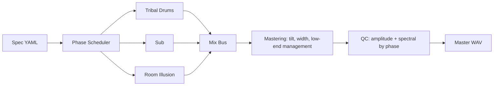

# ARC Signal Chain

Family-level audio chain showing layer families, mix bus, mastering, and QC gates.

| Layer Type | Presence |
|---|---:|
| `tribal_drums` | 3/3 specs |
| `sub` | 3/3 specs |
| `room_illusion` | 3/3 specs |

