# ATTN Phase Timelines

Generated from active specs. Use these as timing-reference diagrams for narration and mix decisions.

## FSP-02 - Distributed Attention

Duration: **25m** (1500s)

```mermaid
gantt
title FSP-02 Phase Timeline
dateFormat X
axisFormat %M:%S
section Session
Anchor : 0, 300
Distribute : 300, 900
Integrate : 1200, 300
```

| Phase | Start | End | Intent |
|---|---:|---:|---|
| Anchor | 00:00 | 05:00 | Anchor awareness to breath and posture |
| Distribute | 05:00 | 20:00 | Broaden attentional field while preserving center |
| Integrate | 20:00 | 25:00 | Consolidate gains and return to a usable baseline |

## FSP-03 - Rapid Context Switching

Duration: **15m** (900s)

| Phase | Start | End | Intent |
|---|---:|---:|---|
| Baseline | 00:00 | 03:00 | Map current state clearly before modulation |
| Switch | 03:00 | 12:00 | Practice clean context shifts without losing stability |
| Stabilize | 12:00 | 15:00 | Reintegrate and stabilize at an everyday baseline |

