# BODY Phase Timelines

Generated from active specs. Use these as timing-reference diagrams for narration and mix decisions.

## BODY-01 - Grounded Power — Embodied Presence

Duration: **15m** (900s)

```mermaid
gantt
title BODY-01 Phase Timeline
dateFormat X
axisFormat %M:%S
section Session
Root : 0, 300
Build : 300, 420
Hold : 720, 180
```

| Phase | Start | End | Intent |
|---|---:|---:|---|
| Root | 00:00 | 05:00 | Establish ground connection |
| Build | 05:00 | 12:00 | Accumulate power |
| Hold | 12:00 | 15:00 | Stable embodied presence |

## BODY-02 - Power Embodiment

Duration: **20m** (1200s)

```mermaid
gantt
title BODY-02 Phase Timeline
dateFormat X
axisFormat %M:%S
section Session
Awaken : 0, 300
Amplify : 300, 600
Anchor : 900, 300
```

| Phase | Start | End | Intent |
|---|---:|---:|---|
| Awaken | 00:00 | 05:00 | Establish baseline stability for the session |
| Amplify | 05:00 | 15:00 | Increase grounding, embodiment, and somatic readiness |
| Anchor | 15:00 | 20:00 | Anchor awareness to breath and posture |

