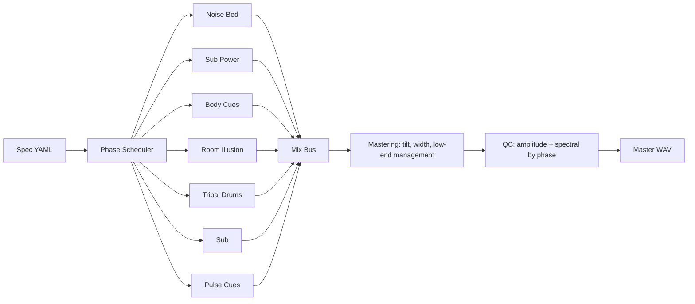

# BODY Signal Chain

Family-level audio chain showing layer families, mix bus, mastering, and QC gates.

| Layer Type | Presence |
|---|---:|
| `noise_bed` | 1/2 specs |
| `sub_power` | 1/2 specs |
| `body_cues` | 1/2 specs |
| `room_illusion` | 1/2 specs |
| `tribal_drums` | 1/2 specs |
| `sub` | 1/2 specs |
| `pulse_cues` | 1/2 specs |

