# CREA Phase Timelines

Generated from active specs. Use these as timing-reference diagrams for narration and mix decisions.

## CREA-01 - Pattern Disruption — Creative Emergence

Duration: **15m** (900s)

```mermaid
gantt
title CREA-01 Phase Timeline
dateFormat X
axisFormat %M:%S
section Session
Baseline : 0, 180
Perturbation : 180, 420
Emergence : 600, 300
```

| Phase | Start | End | Intent |
|---|---:|---:|---|
| Baseline | 00:00 | 03:00 | Establish predictable rhythm |
| Perturbation | 03:00 | 10:00 | Introduce controlled irregularity |
| Emergence | 10:00 | 15:00 | Open associative space |

## CREA-02 - Divergent Thinking

Duration: **20m** (1200s)

```mermaid
gantt
title CREA-02 Phase Timeline
dateFormat X
axisFormat %M:%S
section Session
Baseline : 0, 300
Diverge : 300, 600
Integrate : 900, 300
```

| Phase | Start | End | Intent |
|---|---:|---:|---|
| Baseline | 00:00 | 05:00 | Map current state clearly before modulation |
| Diverge | 05:00 | 15:00 | Open cognitive flexibility and increase associative range |
| Integrate | 15:00 | 20:00 | Consolidate gains and return to a usable baseline |

## CREA-03 - Pattern Disruption

Duration: **25m** (1500s)

```mermaid
gantt
title CREA-03 Phase Timeline
dateFormat X
axisFormat %M:%S
section Session
Baseline : 0, 300
Disrupt : 300, 900
Emerge : 1200, 300
```

| Phase | Start | End | Intent |
|---|---:|---:|---|
| Baseline | 00:00 | 05:00 | Map current state clearly before modulation |
| Disrupt | 05:00 | 20:00 | Open cognitive flexibility and increase associative range |
| Emerge | 20:00 | 25:00 | Reintegrate and stabilize at an everyday baseline |

