# FLOW Phase Timelines

Generated from active specs. Use these as timing-reference diagrams for narration and mix decisions.

## FLOW-01 - Predictive Entrainment — Flow State Induction

Duration: **18m** (1080s)

```mermaid
gantt
title FLOW-01 Phase Timeline
dateFormat X
axisFormat %M:%S
section Session
Entry : 0, 300
Immersion : 300, 600
Sustain : 900, 180
```

| Phase | Start | End | Intent |
|---|---:|---:|---|
| Entry | 00:00 | 05:00 | Establish baseline rhythm |
| Immersion | 05:00 | 15:00 | Reduce self-monitoring, predictive groove |
| Sustain | 15:00 | 18:00 | Maintain flow state |

## FLOW-02 - Deep Immersion

Duration: **25m** (1500s)

```mermaid
gantt
title FLOW-02 Phase Timeline
dateFormat X
axisFormat %M:%S
section Session
Entry : 0, 300
Deepen : 300, 900
Sustain : 1200, 300
```

| Phase | Start | End | Intent |
|---|---:|---:|---|
| Entry | 00:00 | 05:00 | Transition from scattered attention into coherent focus |
| Deepen | 05:00 | 20:00 | Deepen immersion while reducing self-monitoring |
| Sustain | 20:00 | 25:00 | Maintain continuity of the trained state with low effort |

