# FSP Phase Timelines

Generated from active specs. Use these as timing-reference diagrams for narration and mix decisions.

## FSP-01 - Focused State Protocol — Gateway-Inspired Attentional Architecture

Duration: **31m** (1860s)

```mermaid
gantt
title FSP-01 Phase Timeline
dateFormat X
axisFormat %M:%S
section Session
Downshift : 0, 420
Body Scan : 420, 300
Attentional Lock : 720, 480
State Shift : 1200, 480
Reintegration : 1680, 180
```

| Phase | Start | End | Intent |
|---|---:|---:|---|
| Downshift | 00:00 | 07:00 | Calm breath-driven parasympathetic activation |
| Body Scan | 07:00 | 12:00 | Somatic awareness grounding |
| Attentional Lock | 12:00 | 20:00 | Narrow focus window with binaural entrainment |
| State Shift | 20:00 | 28:00 | Controlled depth with descending binaural ramp |
| Reintegration | 28:00 | 31:00 | Gentle return to baseline alertness |

