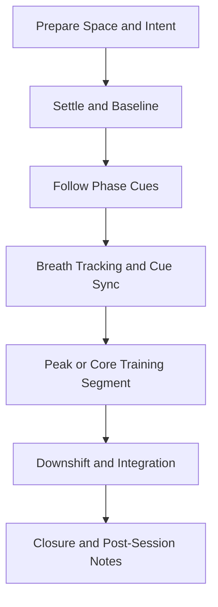

# FSP Practice Flow

Standard facilitation flow for this family. Use alongside protocol timelines and narration scripts.

Breath presets detected: **4-6 (2)**

## Protocol Coverage

| Protocol | Primary Goal |
|---|---|
| `FSP-01` | Gentle return to baseline alertness |

