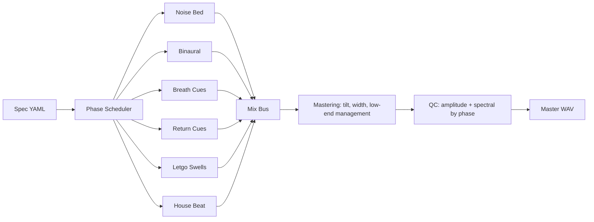

# FSP Signal Chain

Family-level audio chain showing layer families, mix bus, mastering, and QC gates.

| Layer Type | Presence |
|---|---:|
| `noise_bed` | 1/1 specs |
| `binaural` | 1/1 specs |
| `breath_cues` | 1/1 specs |
| `return_cues` | 1/1 specs |
| `letgo_swells` | 1/1 specs |
| `house_beat` | 1/1 specs |

