# META Phase Timelines

Generated from active specs. Use these as timing-reference diagrams for narration and mix decisions.

## META-01 - Observer Dissolution — Non-Dual Pointer

Duration: **20m** (1200s)

```mermaid
gantt
title META-01 Phase Timeline
dateFormat X
axisFormat %M:%S
section Session
Locate Observer : 0, 300
Spatial Shift : 300, 600
Dissolve : 900, 300
```

| Phase | Start | End | Intent |
|---|---:|---:|---|
| Locate Observer | 00:00 | 05:00 | Identify sense of self |
| Spatial Shift | 05:00 | 15:00 | Relocate self-reference |
| Dissolve | 15:00 | 20:00 | Separate awareness from content |

## META-02 - Witness Perspective

Duration: **30m** (1800s)

```mermaid
gantt
title META-02 Phase Timeline
dateFormat X
axisFormat %M:%S
section Session
Identify : 0, 600
Separate : 600, 600
Witness : 1200, 600
```

| Phase | Start | End | Intent |
|---|---:|---:|---|
| Identify | 00:00 | 10:00 | Establish baseline stability for the session |
| Separate | 10:00 | 20:00 | Reduce self-referential load and stabilize observing awareness |
| Witness | 20:00 | 30:00 | Reintegrate and stabilize at an everyday baseline |

## META-03 - No-Self Inquiry

Duration: **35m** (2100s)

```mermaid
gantt
title META-03 Phase Timeline
dateFormat X
axisFormat %M:%S
section Session
Ground : 0, 600
Dissolve : 600, 900
Rest : 1500, 600
```

| Phase | Start | End | Intent |
|---|---:|---:|---|
| Ground | 00:00 | 10:00 | Establish body-based stability and regulate baseline arousal |
| Dissolve | 10:00 | 25:00 | Reduce self-referential load and stabilize observing awareness |
| Rest | 25:00 | 35:00 | Reintegrate and stabilize at an everyday baseline |

