# PAIN Phase Timelines

Generated from active specs. Use these as timing-reference diagrams for narration and mix decisions.

## PAIN-01 - Gate Control

Duration: **15m** (900s)

```mermaid
gantt
title PAIN-01 Phase Timeline
dateFormat X
axisFormat %M:%S
section Session
Locate : 0, 300
Modulate : 300, 420
Release : 720, 180
```

| Phase | Start | End | Intent |
|---|---:|---:|---|
| Locate | 00:00 | 05:00 | Locate and characterize salient sensation without reactivity |
| Modulate | 05:00 | 12:00 | Shift signal weighting through paced attention and breath |
| Release | 12:00 | 15:00 | Release residual tension and return to balance |

## PAIN-02 - Sensation Reframe

Duration: **20m** (1200s)

```mermaid
gantt
title PAIN-02 Phase Timeline
dateFormat X
axisFormat %M:%S
section Session
Baseline : 0, 300
Reframe : 300, 600
Integrate : 900, 300
```

| Phase | Start | End | Intent |
|---|---:|---:|---|
| Baseline | 00:00 | 05:00 | Map current state clearly before modulation |
| Reframe | 05:00 | 15:00 | Reinterpret sensation through context and attentional control |
| Integrate | 15:00 | 20:00 | Consolidate gains and return to a usable baseline |

