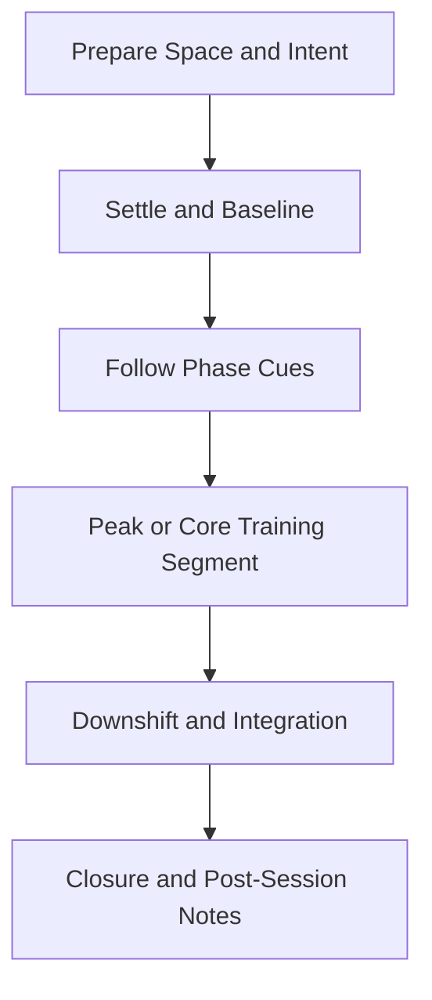

# PAIN Practice Flow

Standard facilitation flow for this family. Use alongside protocol timelines and narration scripts.

Breath presets detected: **none**

## Protocol Coverage

| Protocol | Primary Goal |
|---|---|
| `PAIN-01` | Release residual tension and return to balance |
| `PAIN-02` | Consolidate gains and return to a usable baseline |

