# PERF Phase Timelines

Generated from active specs. Use these as timing-reference diagrams for narration and mix decisions.

## PERF-01 - Pre-Mission Focus — Calm Alert Coherence

Duration: **12m** (720s)

```mermaid
gantt
title PERF-01 Phase Timeline
dateFormat X
axisFormat %M:%S
section Session
Ground : 0, 180
Sharpen : 180, 360
Lock : 540, 180
```

| Phase | Start | End | Intent |
|---|---:|---:|---|
| Ground | 00:00 | 03:00 | Establish baseline calm |
| Sharpen | 03:00 | 09:00 | Narrow attention, increase alertness |
| Lock | 09:00 | 12:00 | Stable ready state |

## PERF-02 - Post-Performance Recovery — Parasympathetic Return

Duration: **15m** (900s)

```mermaid
gantt
title PERF-02 Phase Timeline
dateFormat X
axisFormat %M:%S
section Session
Acknowledge : 0, 180
Descend : 180, 540
Integrate : 720, 180
```

| Phase | Start | End | Intent |
|---|---:|---:|---|
| Acknowledge | 00:00 | 03:00 | Recognize completion |
| Descend | 03:00 | 12:00 | Gradual parasympathetic activation |
| Integrate | 12:00 | 15:00 | Settle into baseline |

## PERF-03 - Micro-Dose Focus

Duration: **5m** (300s)

```mermaid
gantt
title PERF-03 Phase Timeline
dateFormat X
axisFormat %M:%S
section Session
Ramp : 0, 180
Peak : 180, 120
```

| Phase | Start | End | Intent |
|---|---:|---:|---|
| Ramp | 00:00 | 03:00 | Increase activation gradually while maintaining control |
| Peak | 03:00 | 05:00 | Stabilize high activation without overshoot |

