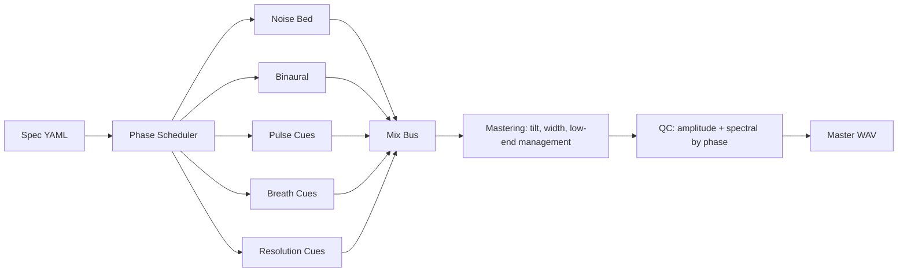

# PERF Signal Chain

Family-level audio chain showing layer families, mix bus, mastering, and QC gates.

| Layer Type | Presence |
|---|---:|
| `noise_bed` | 3/3 specs |
| `binaural` | 3/3 specs |
| `pulse_cues` | 2/3 specs |
| `breath_cues` | 1/3 specs |
| `resolution_cues` | 1/3 specs |

