# RECON Phase Timelines

Generated from active specs. Use these as timing-reference diagrams for narration and mix decisions.

## RECON-01 - Memory Reconsolidation Lite — Safe Reprocessing

Duration: **25m** (1500s)

```mermaid
gantt
title RECON-01 Phase Timeline
dateFormat X
axisFormat %M:%S
section Session
Safe Container : 0, 300
Gentle Activation : 300, 300
Reframe Window : 600, 600
Resolution : 1200, 300
```

| Phase | Start | End | Intent |
|---|---:|---:|---|
| Safe Container | 00:00 | 05:00 | Establish safety and grounding |
| Gentle Activation | 05:00 | 10:00 | Mild sympathetic activation |
| Reframe Window | 10:00 | 20:00 | Memory access with theta support |
| Resolution | 20:00 | 25:00 | Parasympathetic integration |

## RECON-02 - Grief Container — Loss Processing

Duration: **35m** (2100s)

```mermaid
gantt
title RECON-02 Phase Timeline
dateFormat X
axisFormat %M:%S
section Session
Safe Space : 0, 420
Allow : 420, 780
Resolution : 1200, 900
```

| Phase | Start | End | Intent |
|---|---:|---:|---|
| Safe Space | 00:00 | 07:00 | Build psychological and physiological safety before deeper work |
| Allow | 07:00 | 20:00 | Allow experience to arise without suppression or escalation |
| Resolution | 20:00 | 35:00 | Downshift activation and consolidate processing |

## RECON-03 - Shadow Integration

Duration: **40m** (2400s)

```mermaid
gantt
title RECON-03 Phase Timeline
dateFormat X
axisFormat %M:%S
section Session
Ground : 0, 600
Explore : 600, 1200
Integrate : 1800, 600
```

| Phase | Start | End | Intent |
|---|---:|---:|---|
| Ground | 00:00 | 10:00 | Establish body-based stability and regulate baseline arousal |
| Explore | 10:00 | 30:00 | Engage material with steady attention and emotional range |
| Integrate | 30:00 | 40:00 | Consolidate gains and return to a usable baseline |

