# SENSE Phase Timelines

Generated from active specs. Use these as timing-reference diagrams for narration and mix decisions.

## SENSE-01 - Hyper-Perceptual Field — Sensory Amplification

Duration: **10m** (600s)

| Phase | Start | End | Intent |
|---|---:|---:|---|
| Calibrate | 00:00 | 02:00 | Baseline sensory awareness |
| Amplify | 02:00 | 08:00 | Increase resolution |
| Integrate | 08:00 | 10:00 | Stabilize heightened state |

## SENSE-02 - Interoceptive Precision — Internal Signal Awareness

Duration: **15m** (900s)

```mermaid
gantt
title SENSE-02 Phase Timeline
dateFormat X
axisFormat %M:%S
section Session
Baseline : 0, 180
Amplify Internal : 180, 540
Integrate : 720, 180
```

| Phase | Start | End | Intent |
|---|---:|---:|---|
| Baseline | 00:00 | 03:00 | Map current state clearly before modulation |
| Amplify Internal | 03:00 | 12:00 | Increase signal resolution while maintaining regulation |
| Integrate | 12:00 | 15:00 | Consolidate gains and return to a usable baseline |

## SENSE-03 - Synesthetic Mapping

Duration: **20m** (1200s)

```mermaid
gantt
title SENSE-03 Phase Timeline
dateFormat X
axisFormat %M:%S
section Session
Anchor : 0, 240
Cross : 240, 720
Integrate : 960, 240
```

| Phase | Start | End | Intent |
|---|---:|---:|---|
| Anchor | 00:00 | 04:00 | Anchor awareness to breath and posture |
| Cross | 04:00 | 16:00 | Increase signal resolution while maintaining regulation |
| Integrate | 16:00 | 20:00 | Consolidate gains and return to a usable baseline |

