# SLEEP Phase Timelines

Generated from active specs. Use these as timing-reference diagrams for narration and mix decisions.

## SLEEP-01 - Hypnagogic Drift — Theta Descent

Duration: **30m** (1800s)

```mermaid
gantt
title SLEEP-01 Phase Timeline
dateFormat X
axisFormat %M:%S
section Session
Settle : 0, 300
Descent : 300, 900
Threshold : 1200, 600
```

| Phase | Start | End | Intent |
|---|---:|---:|---|
| Settle | 00:00 | 05:00 | Initial relaxation |
| Descent | 05:00 | 20:00 | Gradual theta descent |
| Threshold | 20:00 | 30:00 | Hypnagogic boundary |

## SLEEP-02 - Lucid Dream Induction — Conscious Dream Entry

Duration: **40m** (2400s)

```mermaid
gantt
title SLEEP-02 Phase Timeline
dateFormat X
axisFormat %M:%S
section Session
Settle : 0, 600
Theta Plateau : 600, 1200
Dream Threshold : 1800, 600
```

| Phase | Start | End | Intent |
|---|---:|---:|---|
| Settle | 00:00 | 10:00 | Settle attention and reduce cognitive noise |
| Theta Plateau | 10:00 | 30:00 | Sustain target intensity with steady pacing |
| Dream Threshold | 30:00 | 40:00 | Support threshold awareness while maintaining relaxation |

## SLEEP-03 - Deep Delta

Duration: **50m** (3000s)

```mermaid
gantt
title SLEEP-03 Phase Timeline
dateFormat X
axisFormat %M:%S
section Session
Drift : 0, 900
Descend : 900, 1200
Deep : 2100, 900
```

| Phase | Start | End | Intent |
|---|---:|---:|---|
| Drift | 00:00 | 15:00 | Permit low-effort descent toward hypnagogic rest |
| Descend | 15:00 | 35:00 | Downshift arousal and support transition toward rest |
| Deep | 35:00 | 50:00 | Reintegrate and stabilize at an everyday baseline |

