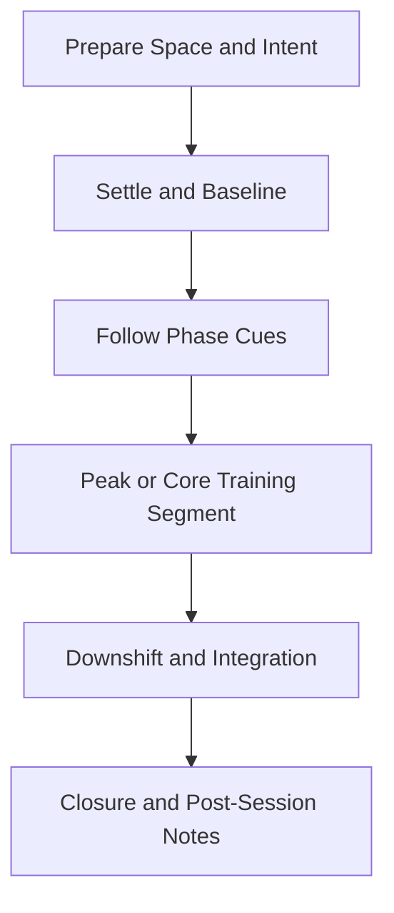

# SLEEP Practice Flow

Standard facilitation flow for this family. Use alongside protocol timelines and narration scripts.

Breath presets detected: **none**

## Protocol Coverage

| Protocol | Primary Goal |
|---|---|
| `SLEEP-01` | Hypnagogic boundary |
| `SLEEP-02` | Support threshold awareness while maintaining relaxation |
| `SLEEP-03` | Reintegrate and stabilize at an everyday baseline |

