# SOC Phase Timelines

Generated from active specs. Use these as timing-reference diagrams for narration and mix decisions.

## SOC-01 - Dyadic Breath Sync — Two-Person Coherence

Duration: **20m** (1200s)

```mermaid
gantt
title SOC-01 Phase Timeline
dateFormat X
axisFormat %M:%S
section Session
Individual : 0, 300
Alternating : 300, 420
Converge : 720, 480
```

| Phase | Start | End | Intent |
|---|---:|---:|---|
| Individual | 00:00 | 05:00 | Establish individual rhythm |
| Alternating | 05:00 | 12:00 | Alternate breath cues L/R |
| Converge | 12:00 | 20:00 | Synchronized breathing |

## SOC-02 - Group Resonance

Duration: **30m** (1800s)

```mermaid
gantt
title SOC-02 Phase Timeline
dateFormat X
axisFormat %M:%S
section Session
Attune : 0, 600
Sync : 600, 600
Resonate : 1200, 600
```

| Phase | Start | End | Intent |
|---|---:|---:|---|
| Attune | 00:00 | 10:00 | Increase interpersonal sensitivity and timing awareness |
| Sync | 10:00 | 20:00 | Align rhythm and attention across participants |
| Resonate | 20:00 | 30:00 | Stabilize shared coherence without emotional spillover |

