# SUN Phase Timelines

Generated from active specs. Use these as timing-reference diagrams for narration and mix decisions.

## SUN-01 - Small Universe - Beginner Orbit

Duration: **18m** (1080s)

```mermaid
gantt
title SUN-01 Phase Timeline
dateFormat X
axisFormat %M:%S
section Session
Settle : 0, 180
Orbit Foundation : 180, 720
Seal : 900, 180
```

| Phase | Start | End | Intent |
|---|---:|---:|---|
| Settle | 00:00 | 03:00 | Relax body and gather at lower dantian |
| Orbit Foundation | 03:00 | 15:00 | One gentle orbit per 6-6 breath cycle |
| Seal | 15:00 | 18:00 | Store and seal at lower dantian |

## SUN-02 - Small Universe - Intermediate Orbit

Duration: **24m** (1440s)

```mermaid
gantt
title SUN-02 Phase Timeline
dateFormat X
axisFormat %M:%S
section Session
Settle : 0, 240
Back Channel Rise : 240, 540
Front Channel Descent : 780, 480
Seal : 1260, 180
```

| Phase | Start | End | Intent |
|---|---:|---:|---|
| Settle | 00:00 | 04:00 | Lower dantian grounding and soft body release |
| Back Channel Rise | 04:00 | 13:00 | Inhale rise up spine toward crown |
| Front Channel Descent | 13:00 | 21:00 | Exhale descent down front body to lower dantian |
| Seal | 21:00 | 24:00 | Store and seal at lower dantian |

## SUN-03 - Small Universe - Advanced Three Dantian Orbit

Duration: **36m** (2160s)

```mermaid
gantt
title SUN-03 Phase Timeline
dateFormat X
axisFormat %M:%S
section Session
Lower Dantian Root : 0, 360
Middle Dantian Open : 360, 420
Upper Dantian Clarify : 780, 420
Full Orbit : 1200, 780
Seal : 1980, 180
```

| Phase | Start | End | Intent |
|---|---:|---:|---|
| Lower Dantian Root | 00:00 | 06:00 | Store and stabilize in lower dantian |
| Middle Dantian Open | 06:00 | 13:00 | Warm chest center and soften front channel |
| Upper Dantian Clarify | 13:00 | 20:00 | Light upper center with relaxed gaze |
| Full Orbit | 20:00 | 33:00 | One full orbit per long breath cycle |
| Seal | 33:00 | 36:00 | Return all energy to lower dantian and seal |

