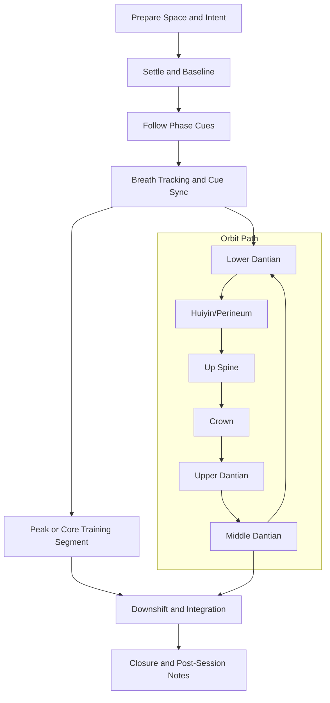

# SUN Practice Flow

Standard facilitation flow for this family. Use alongside protocol timelines and narration scripts.

Breath presets detected: **6-6 (4), 6-8 (2), 10-10 (2)**

## Protocol Coverage

| Protocol | Primary Goal |
|---|---|
| `SUN-01` | Store and seal at lower dantian |
| `SUN-02` | Store and seal at lower dantian |
| `SUN-03` | Return all energy to lower dantian and seal |
| `SUN-04` | Store energy in lower dantian and close gently |

